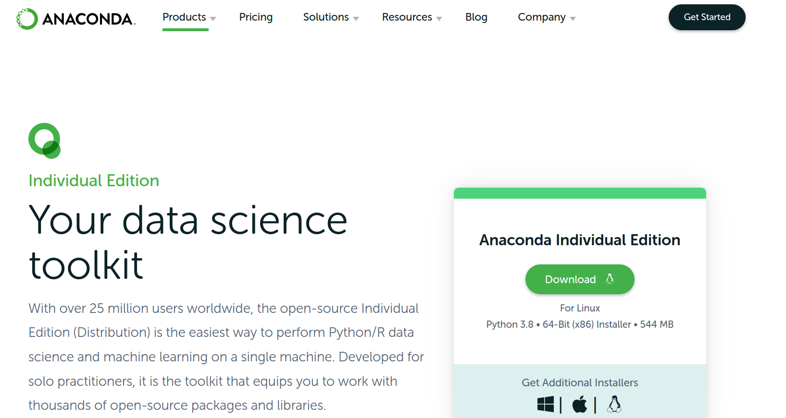
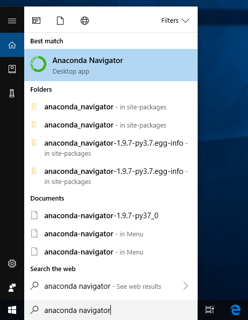
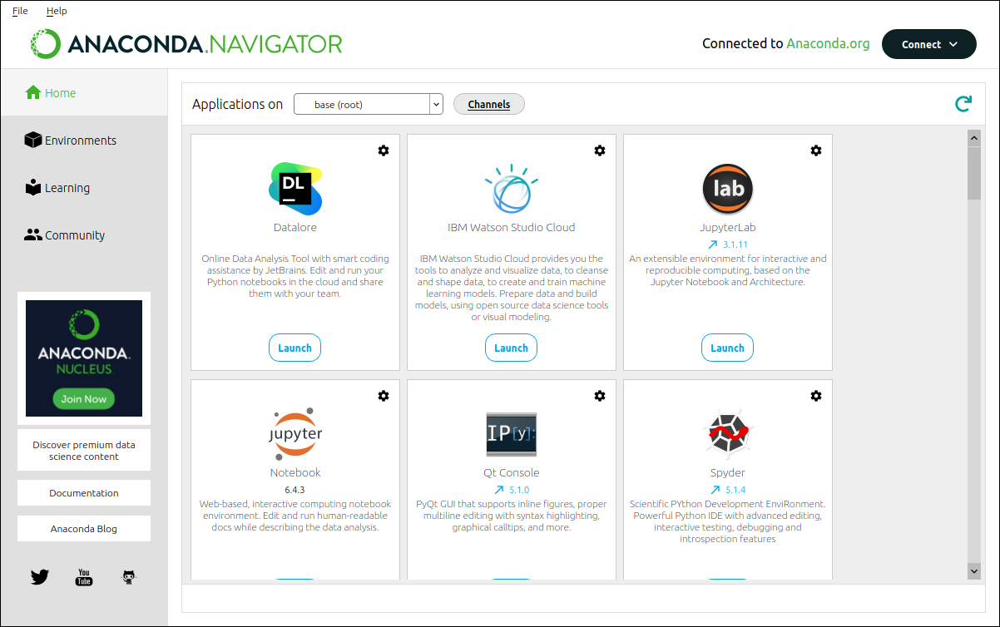
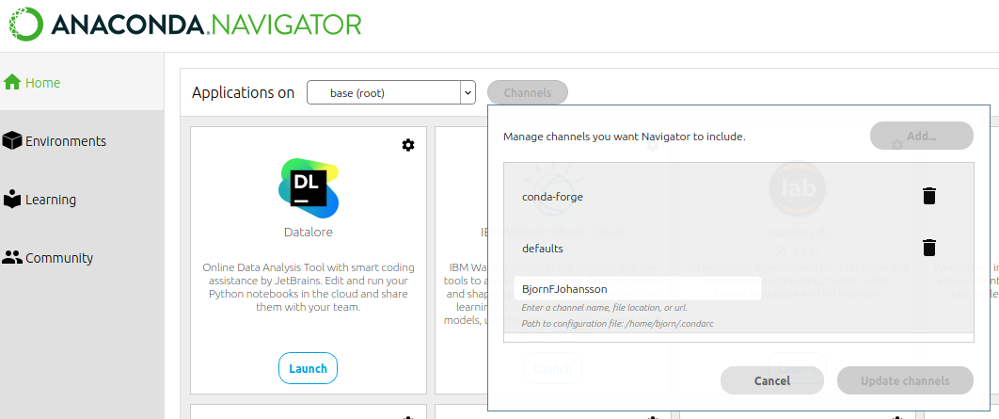
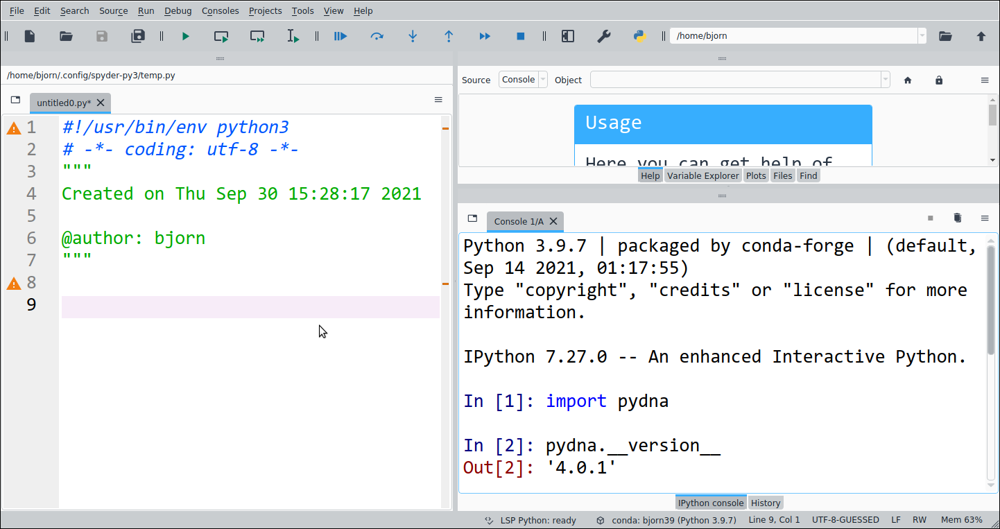

Installing Anaconda

The Anaconda Scientific Python distribution from Continuum analytics is
a nice way to install python on any computer. Anaconda makes it easier
to install dependencies and it is avalible for free. The the whole
installation is located in a folder in the user's directory in a folder
that is easily removable. Anaconda is available for the Microsoft
Windows, MacOSX and Linux platforms.

Anaconda installation

Go to the [website](https://store.continuum.io/cshop/anaconda/) of
Anaconda (Fig ). Download the Anaconda installation file for your
operating system and follow the installation instructions and select
default options whenever applicable.

<figure>
<figcaption aria-hidden="true">Fig 1: Anaconda download <a href="https://store.continuum.io/cshop/anaconda/">site</a> </figcaption>
</figure>

The installation file is large, but files are only installed in one
directory in the users private folder.

Installation on Microsoft Windows

Double click the installer to launch

Installation on MacOSX

Double-click the downloaded file and click continue to start the
installation

Installation on Linux

Type: bash Anaconda3-2021.05-Linux-x86_64.sh

If you have any trouble with this step, check the detailed instructions
[here](https://docs.anaconda.com/anaconda/install).

When you have installed Anaconda, the next step is to start the Anaconda
Navigator. How to do this may differ between platforms. The MacOSX
installer leaves a green Anaconda shortcut on the desktop (Fig ).

<figure>
<figcaption aria-hidden="true">Fig 2: The Anaconda Launcher icon is placed on the MacOSX desktop in the upper left corner.</figcaption>
</figure>

Anaconda Navigator looks like in

<figure>
<figcaption aria-hidden="true">Fig 3</figcaption>
</figure>

Adding a software channel

It is necessary the tell Anaconda where to find useful software. We can
do this by adding a software channel to Launcher. Click on the
“**Channels**” link in the upper right corner of the window (Fig ). Add
the channel “BjornFJohansson” as shown in Fig 4 and press return.

<figure>
<figcaption aria-hidden="true">Fig 4: Adding the Anaconda software channel <strong>BjornFJohansson</strong></figcaption>
</figure>

When The “conda-forge” channel may not be present on your computer. It
is probably not needed. The important thing is that the
**BjornFJohansson** channel is at the end.

Install the pydna python package

Follow the five steps in :

1 Activate the “Environments” tab

2 Select “all”

3 type “pydna” in the text box

4 Click the checkbox

5 Click “Apply”

Verify installation

Start “Spyder” from the start menu of your computer.

Type:

*import pydna* ⮠

*pydna.\_\_version\_\_*⮠

As indicated in (⮠ = return key).

<figure>
<figcaption aria-hidden="true">Fig 6: Spyder with pydna installed.</figcaption>
</figure>
