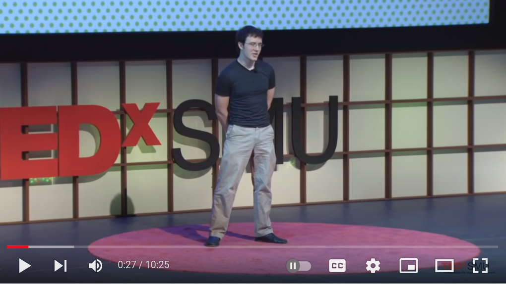
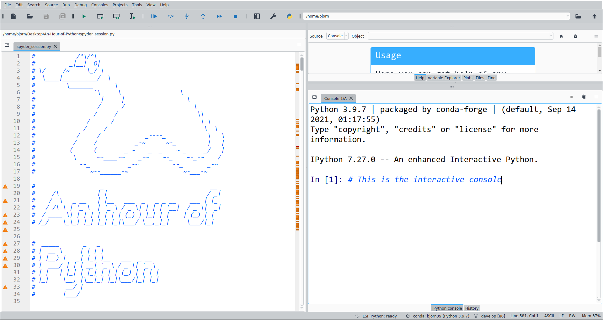

# An-Hour-of-Python 

### Programming?

[](https://youtu.be/IY7EsTnUSxY?t=2)

Steve Jobs once [said](https://youtu.be/IY7EsTnUSxY?t=2):


“**Everybody in this country should learn to program a computer, because it teaches you how to think**”.


I fully agree with this, programming is not just a way to solve problems or getting
things done, but it can be so much more.


If you learn programming, you will see how your coding skills can affect the ways you think
as you progress to gain more knowledge. After all, if you know a problem well enough to describe
it to a computer, you probably know it better than most.


[](https://youtu.be/xfBWk4nw440?t=24)


This [TED talk](https://youtu.be/xfBWk4nw440?t=24) (10 min) by [Christian Genco](https://christian.gen.co/you-should-learn-to-program)
sums up the argument in a nice way.


### Python :snake:

[](https://xkcd.com)

Python i a general programming language, the world's most popular in 2019 and its popularity has [only increased since](https://pypl.github.io/PYPL.html). Python is especially popular in the fields of [data science](https://en.wikipedia.org/wiki/Data_science) and [bioinformatics](https://en.wikipedia.org/wiki/Bioinformatics), two fields that should be of interest to a biology student.

Python is known to have a simple compact syntax and easily readable code since it contains few special characters, such as semicolons.

Compare the two programs below, the first one in C++, another popular coding language and then the same program in Python.

#### C++

```C++
// This C++ program prints Hello, World!
#include <iostream>

int main()
{
    std::cout << "Hello, World! \n";
    return 0;
}
```

#### Python

```python
# This Python program prints Hello, World!
print("Hello, World! \n")

```
The goal of the program is to print the message "Hello World!" on the screen, which is probably obvious. I think most people would agree that the Python version is more intuitive.

This is not to say that one computer language (such as Python) is necessarily better than another for all purposes. However, it is safe to say that Python is probably one of the best for beginners.

Because of its simplicity, Python is suitable for people who do not code every day (like me). It is suitable both for quick scripts for automation of some repetitive task but also for complex software with graphical interfaces and websites.


One of the most important advantages of Python is the **large size of its community**, since this means that you can often find questions and answers to your coding problems by a simply searching with [google](https://www.google.com/search?q=loop+over+a+dictionary+python).

An added benefit is the large variety of functionality that has been created and made available in software packages.

A software package is a collection of files, usually to solve common problems in a specific area such as statistics or bioinformatics, that has been packaged for distribution and installation.

Widely used Python packages include:
- Numpy - comprehensive mathematical functions
- SciPy - algorithms for optimization, integration, interpolation
- Biopython - tools for biological computation
- Pandas - data analysis and manipulation
- Matplotlib - static, animated, and interactive visualizations
 - scikit-learn - efficient tools for predictive data analysis and machine learning
 - NLTK - programs to work with human language data
 - Pillow - powerful image processing

Python is used for everything from

- Graphical User Interface for sequence checksums ([code](https://github.com/BjornFJohansson/seguid_calculator)).
- Stock and cryptocurrency trading ([video](https://youtu.be/GdlFhF6gjKo)).
- Quantitative Economics ([lectures](https://quantecon.org/python-lectures)).
- Population dynamics ([blog](https://towardsdatascience.com/building-population-models-in-python-57f9e174d27d)).
- Reading data from a commercial temperature data logger ([code](https://github.com/civic/elitech-datareader)).
- Controlling the height of a standing desk [code](https://pypi.org/project/idasen) [video](https://youtu.be/LEXQOhEzVhE?t=404).


You can even make games using Python:

[](https://www.pygame.org)


We will spend one hour (or so) learning the basics of Python using simple examples. The exercises are aimed at complete beginners with no previous programming experience.

The tutor will demonstrate basic data types, repetition and decision making in the logical flow of a program. We will use the [Spyder](https://www.spyder-ide.org) integrated development environment (IDE). At the end we will code a simple example relevant to biology/bioinformatics.


### Installation


The free Anaconda Scientific Python distribution from Continuum analytics is
a nice way to install python on just about any computer. Anaconda is available for the Microsoft Windows, MacOSX and Linux platforms. Anaconda makes it easy to install Python packages with extra functionality. The the whole installation is located in one folder in the user's directory that is easy to uninstall.


Go to the Anaconda [website](https://store.continuum.io/cshop/anaconda) and
download the Anaconda installation file for your operating system. Follow the installation instructions to save the file.  Beware that the installation file is large ~600 mb.

Double click the installer and follow the instructions. Select default options when asked.

For installation on Linux, type: ```bash Anaconda3-2021.05-Linux-x86_64.sh```. in the terminal to start the installation

**If you have any trouble installing, check the detailed instructions [here](https://docs.anaconda.com/anaconda/install).**

The next step is to start the Python editor Spyder.  Start “Spyder” from the start menu of your computer.

# Exercises

The Spyder editor was installed with the Anaconda distribution that you should have installed before this class (See previous section).


[](https://raw.githubusercontent.com/BjornFJohansson/An-Hour-of-Python/main/spyder_session.py)


Download and save the file [```spyder_session.py```](https://raw.githubusercontent.com/BjornFJohansson/An-Hour-of-Python/main/spyder_session.py) on your desktop.


Start Spyder from the start menu of your computer. Open the file using the file>open menu of Spyder. It should look like in the picture below:




Spyder has two important parts, the text editor to the left and the interactive console to the right at the bottom.

We will go through the content of ```spyder_session.py``` together.

### After the class, where to go from here?

I hope this hour has inspired you to learn how to code with Python or another programming language.
As any new language that you might try to learn, you will lose your new knowledge if you do not practise. The challenge is to practise by finding something in your daily life, however small, where you can apply programming to save time or improve quality.

Here is a list of ten suggested programming [projects](https://favtutor.com/blog-details/7-Python-Projects-For-Beginners) for beginners.


### Resources

[Using Python for Research](https://www.edx.org/course/using-python-for-research)

"This course bridges the gap between introductory and advanced courses in Python. While there are many excellent introductory Python courses available, most typically do not go deep enough for you to apply your Python skills to research projects. In this course, after first reviewing the basics of Python 3, we learn about tools commonly used in research settings. This version of the course includes a new module on statistical learning."

----

[Rosalind](http://rosalind.info/problems/locations)

Rosalind is a platform for learning bioinformatics through problem solving.


----

[LeetCode](https://leetcode.com)
is an online judge platforms that you can use to practice your programming skills by solving coding questions.

----

[Python in your browser](https://replit.com)

----

[Visualize your code](https://pythontutor.com)

----

[Python for biologists](http://pythonforbiologists.com)

Here you'll find resources for learning to program in Python for people with a background in biology

----

[Want to learn and master Python?](https://exercism.org/tracks/python)
Exercism’s free Python Track for access to 129 exercises grouped into 15 Python Concepts.

----

[Tutorial - Learn Python in 10 minutes](https://www.stavros.io/tutorials/python)

----

[stepik.org/course/568](https://stepik.org/course/568/promo)

"The course consists of few hundreds of programming assignments for Python, ranging from basics up to complex topics. Right now Stepik is developing an adaptive learning engine which chooses content for each learner individually – by his/her level and knowledge gaps. In this course you can try out the first prototype of this engine."

----

[Pythonroom](https://pythonroom.firebaseapp.com)

Pythonroom lets anyone teach computer science.

----

[How to Think Like a Computer Scientist: Interactive Edition](https://runestone.academy/runestone/books/published/thinkcspy/index.html)

----

[The Python Handbook](https://www.freecodecamp.org/news/the-python-handbook)
