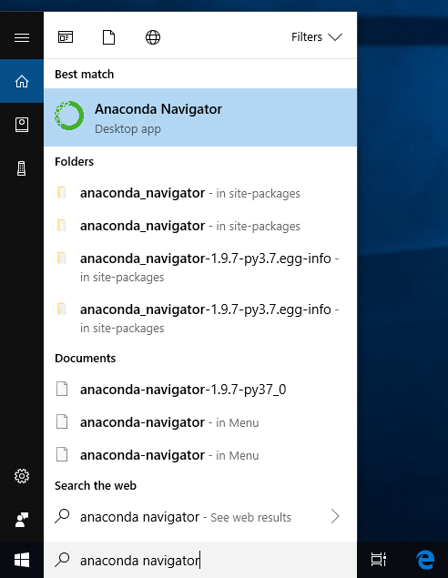
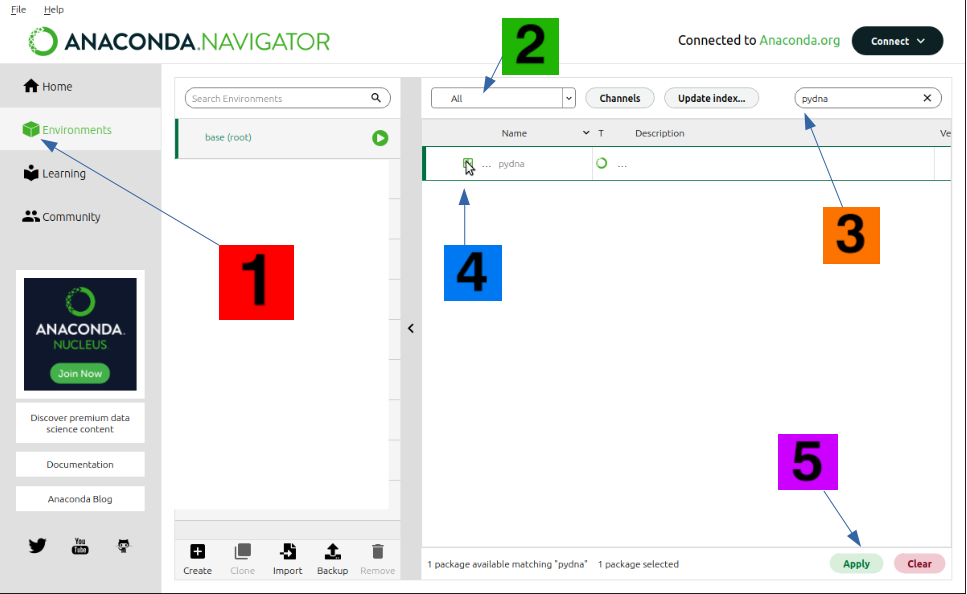
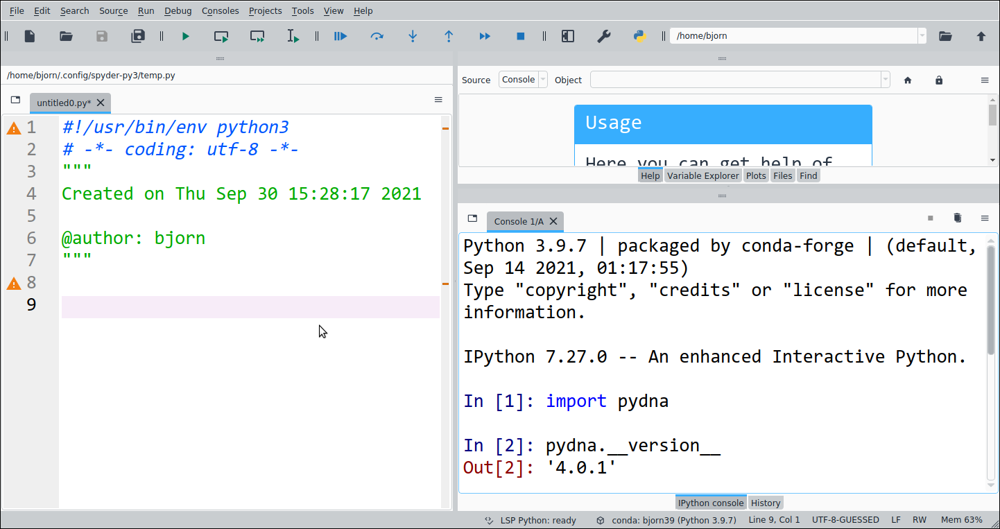

# An-Hour-of-Python  

### Programming?

Steve Jobs once [said](https://youtu.be/IY7EsTnUSxY?t=2):


“Everybody in this country should learn to program a computer, because it teaches you how to think”.


I fully agree with this, programming is not just a way to solve problems or get things done, but it can be so much more.

As you progress to gain more knowledge, you will see how your coding skills can affect the ways you think. After all, if you know a problem well enough to describe it to a computer, you probably know it better than most. This [TED talk](https://youtu.be/xfBWk4nw440?t=24) (10 min) sums up the argument in a nice way. The speaker has a website [here](https://christian.gen.co/you-should-learn-to-program).

### Python

[](https://xkcd.com)

Python i a general programming language, the world's most popular in 2019 and its popularity has [only increased since](https://pypl.github.io/PYPL.html). Python is especially popular in the fields of [data science](https://en.wikipedia.org/wiki/Data_science) and [bioinformatics](https://en.wikipedia.org/wiki/Bioinformatics), two fields that should be of interest to a biology student.

Python is known to have a simple compact syntax and easily readable code since it contains few special characters, such as semicolons.

Compare the two programs below, the first one in C++, another popular coding language and then the same program in Python.

#### C++

```C++
// This C++ program prints Hello, World!
#include <iostream>

int main()
{
    std::cout << "Hello, World! \n";
    return 0;
}
```

#### Python

```python
# This Python program prints Hello, World!
print("Hello, World! \n")
```

This is not to say that one language is necessarily better than another for all purposes. However, it is safe to say that Python is one of the best for beginners.

Because of its simplicity, Python is suitable both for beginners and for people who do not code every day (like me). It is suitable both for quick scripts for automation of some repetitive task but also for complex software with graphical interfaces and websites.


One of the most important advantages of Python is the **large size of its community**, since this means that you can often find questions and answers to your coding problems by a simply searching with [google](https://www.google.com/search?q=loop+over+a+dictionary+python).

Python is used for everything from

- Graphical User Interface for sequence checksums ([code](https://github.com/BjornFJohansson/seguid_calculator)).
- Stock and cryptocurrency trading ([video](https://youtu.be/GdlFhF6gjKo)).
- Quantitative Economics ([lectures](https://quantecon.org/python-lectures)).
- Population dynamics ([blog](https://towardsdatascience.com/building-population-models-in-python-57f9e174d27d)).
- Reading data from a commercial temperature data logger ([code](https://github.com/civic/elitech-datareader)).
- Controlling the height of a standing desk [code](https://pypi.org/project/idasen) [video](https://youtu.be/LEXQOhEzVhE?t=404).


You can even make games using Python:

[](https://www.pygame.org)


We will spend one hour learning the basics of Python using simple examples. The exercises are aimed at complete beginners with no previous programming experience.

The tutor will demonstrate basic data types, repetition and decision making in the logical flow of a program. We will use the [Spyder](https://www.spyder-ide.org) integrated development environment (IDE). At the end we will code a simple example relevant to biology/bioinformatics.

Python will be used to search sequence data on Genbank using [pydna](https://github.com/BjornFJohansson/pydna) and formalize a simple cloning procedure.

### Installation

The Anaconda Scientific Python distribution from Continuum analytics is
a nice way to install python on any computer.

Anaconda makes it easier to install Python pacckages and it is avalible for free. The the whole installation is located in a folder in the user's directory that is easy to remove. 

Anaconda is available for the Microsoft Windows, MacOSX and Linux platforms.

Go to the [website](https://store.continuum.io/cshop/anaconda) of
Anaconda (Fig ). Download the Anaconda installation file for your
operating system and follow the installation instructions and select
default options whenever applicable. Beware that the installation file is large ~400 mb.

Double click the installer and follow the instructions. Select default options when asked.

For installation on Linux, type: ```bash Anaconda3-2021.05-Linux-x86_64.sh```. in the terminal. **If you have any trouble with this step, check the detailed instructions [here](https://docs.anaconda.com/anaconda/install).**

The next step is to start the Anaconda Navigator. How to do this may differ between platforms. The MacOSX installer leaves a green Anaconda shortcut on the desktop. On Windows, there is a shortcut in the launcher:



Anaconda Navigator looks like this:


It is sometimes necessary the tell Anaconda where to find useful software. We can do this by adding a software channel. Click on the “**Channels**” link in the upper right corner of the window. Add the channel ```BjornFJohansson``` as shown below and press return.


When The “conda-forge” channel may not be present on your computer. It
is not needed. The important thing is that the
**BjornFJohansson** channel is at the end.

Follow the five steps below to install the pydna python package:

1 Activate the “Environments” tab

2 Select “all”

3 type “pydna” in the text box

4 Click the checkbox

5 Click “Apply”




Verify installation

Start “Spyder” from the start menu of your computer.

Type:

    import pydna ⮠

    pydna.__version__⮠

As indicated below (⮠ = return key).





## Exercises

The Spyder editor was installed with the Anaconda distribution that you should have installed before this class ([See instructions here](Installation%20instructions/install_Anaconda_and_add_channel.md)).

Start Spyder from the start menu of your computer.


Spyder has two important parts, the text editor to the left and the interactive console to the right at the bottom.

Download and save the file [```spyder_session.py```](spyder_session.py).

Save the file to your computer and open it in Spyder, it should look as the picture above.


### After the class, where to go from here?

As any new language that you might try to learn, you will lose your new knowledge if you do not practise. The challenge is to find something in your daily life, however small, where you can apply programming to save time or improve quality.

Here is a list of ten suggested programming [projects](https://favtutor.com/blog-details/7-Python-Projects-For-Beginners) for beginners.


### Resources

[Using Python for Research](https://www.edx.org/course/using-python-for-research)

"This course bridges the gap between introductory and advanced courses in Python. While there are many excellent introductory Python courses available, most typically do not go deep enough for you to apply your Python skills to research projects. In this course, after first reviewing the basics of Python 3, we learn about tools commonly used in research settings. This version of the course includes a new module on statistical learning."

----

[Rosalind](http://rosalind.info/problems/locations)

Rosalind is a platform for learning bioinformatics through problem solving.

----

[Python in you browser](https://replit.com)

----

[Visualize your code](https://pythontutor.com)

----

[Python for biologists](http://pythonforbiologists.com)

Here you'll find resources for learning to program in Python for people with a background in biology

----

[Want to learn and master Python?](https://exercism.org/tracks/python)
Join Exercism’s Python Track for access to _**129 exercises**_ grouped into 15 Python Concepts, with automatic analysis of your code and _**personal mentoring**_, all _**100% free.**_

----

[Tutorial - Learn Python in 10 minutes](https://www.stavros.io/tutorials/python)

----

[stepik.org/course/568](https://stepik.org/course/568/promo)

"The course consists of few hundreds of programming assignments for Python, ranging from basics up to complex topics. Right now Stepik.org is developing an adaptive learning engine which chooses content for each learner individually – by his/her level and knowledge gaps. In this course you can try out the first prototype of this engine."

----

[Pythonroom](https://pythonroom.firebaseapp.com)

Pythonroom lets anyone teach computer science.

----

[How to Think Like a Computer Scientist: Interactive Edition](https://runestone.academy/runestone/books/published/thinkcspy/index.html)

----

[The Python Handbook](https://www.freecodecamp.org/news/the-python-handbook)
